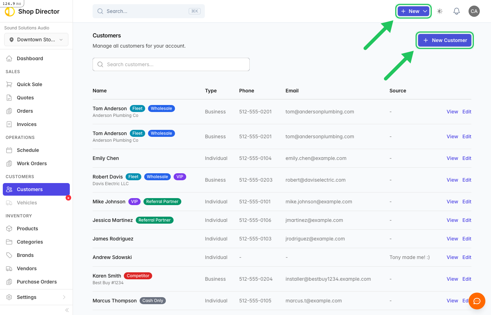
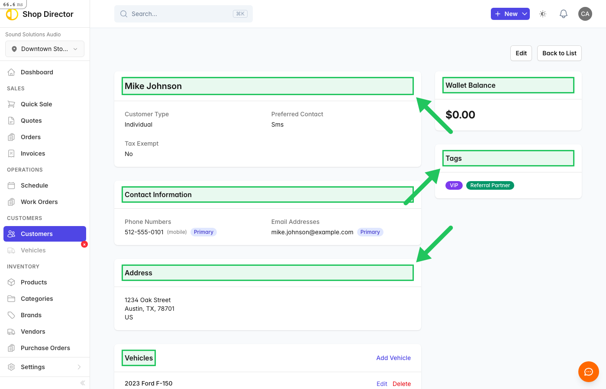
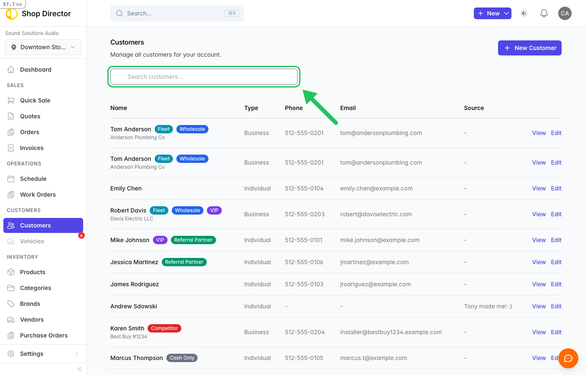

# Customer Management

Keep track of your customers and their vehicles.

## Adding a Customer

1. Go to **Customers** in the sidebar
2. Click **New Customer**
3. Enter contact information:
   - Name
   - Phone
   - Email
   - Address (optional)
4. Save

<!-- SCREENSHOT: /customers | Customers list with new button | highlight:a[href*="customers/new"],.btn-primary -->

## Customer Profiles

Each customer profile shows:

- Contact information
- Vehicles
- Quote history
- Order history
- Notes

<!-- SCREENSHOT: /customers/1 | Customer profile | highlight:.card,.nav-tabs -->

## Managing Vehicles

Add vehicles to customer profiles:

1. Open customer profile
2. Click **Add Vehicle**
3. Enter year, make, model
4. Add VIN if available

## Searching Customers

Use the search bar to find customers by:

- Name
- Phone number
- Email
- Vehicle info

<!-- SCREENSHOT: /customers | Customer search | highlight:input[type="search"],input[placeholder*="Search"] -->

