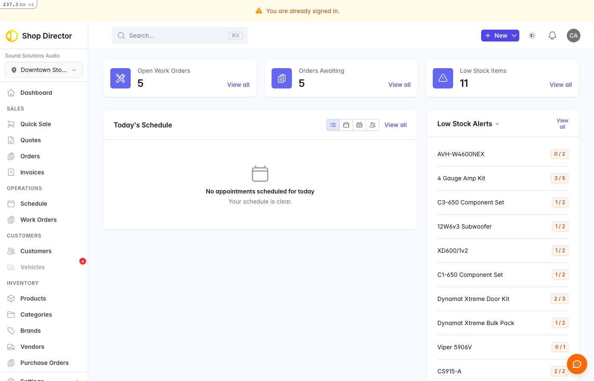

# Logging In

Access your Shop Director account from any device with a web browser.

## Sign In

1. Go to your Shop Director URL (provided by your administrator)
2. Enter your email address
3. Enter your password
4. Click **Sign in**

## Forgot Password

If you've forgotten your password:

1. Click **Forgot your password?** on the login page
2. Enter your email address
3. Click **Send reset instructions**
4. Check your email for a reset link
5. Click the link and create a new password

## Stay Signed In

Shop Director keeps you signed in for convenience. You'll only need to log in again if:

- You click **Sign out**
- You clear your browser cookies
- Your session expires after extended inactivity

## Troubleshooting

**Can't sign in?**

- Double-check your email spelling
- Passwords are case-sensitive
- Try the forgot password flow if needed
- Contact your administrator if problems persist

## Related

- [Quick Start Guide](quick-start.md)
- [Creating Your First Quote](first-quote.md)
