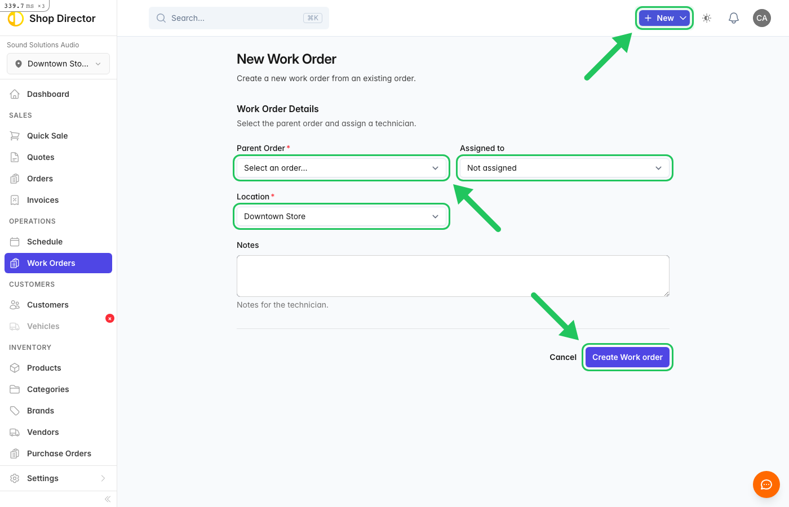
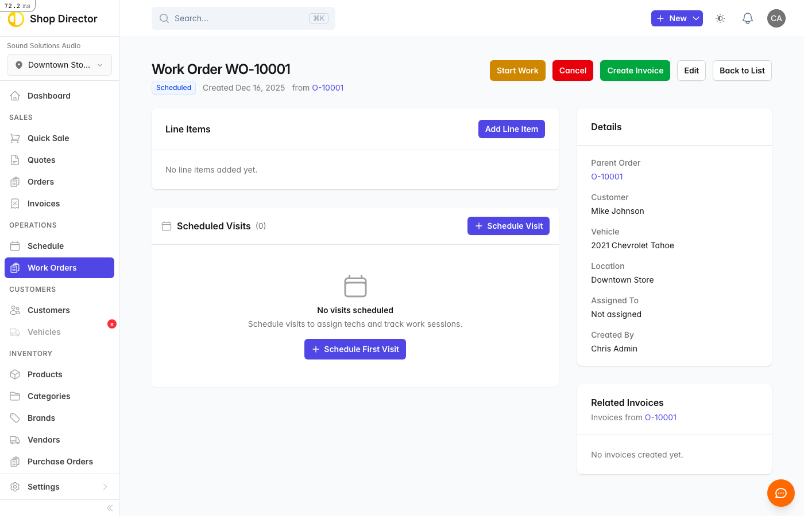

# Managing Appointments

Appointments are scheduled work orders assigned to a bay and time slot.

## Creating an Appointment

From the calendar:

1. Click an empty time slot
2. Select or create an order
3. Choose duration
4. Assign technician (optional)
5. Save

<!-- SCREENSHOT: /work_orders/new | New appointment form | highlight:input[type="submit"],.btn-primary,select -->

## Appointment Details

Each appointment shows:

- Customer name
- Vehicle info
- Job summary
- Assigned technician
- Estimated duration

## Editing Appointments

- **Drag** to reschedule
- **Click** to open details
- **Resize** to change duration

## Completing Work

When the job is done:

1. Open the appointment
2. Click **Mark Complete**
3. Add any final notes
4. Generate invoice

<!-- SCREENSHOT: /work_orders/1 | Work order with complete button | highlight:a[href*="complete"],.btn-success -->

